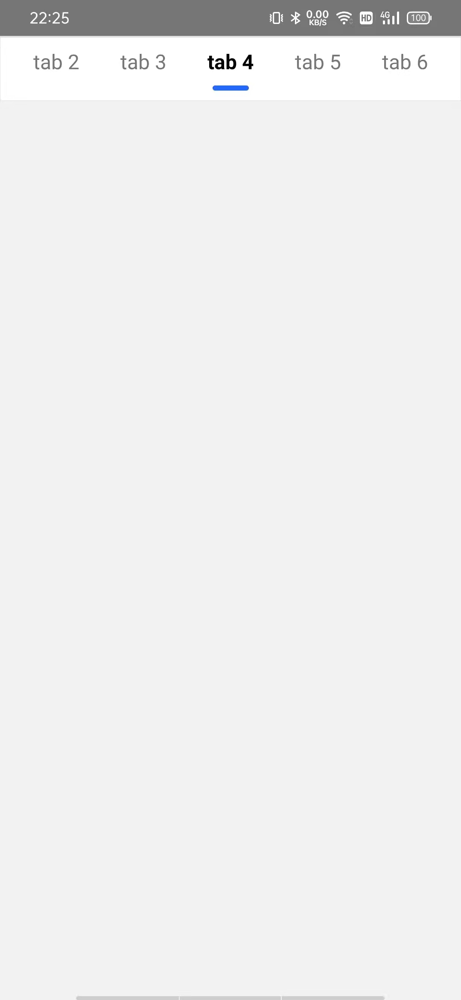
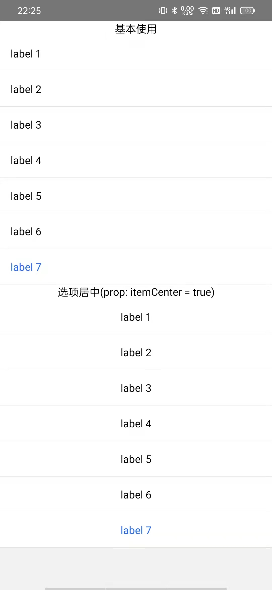
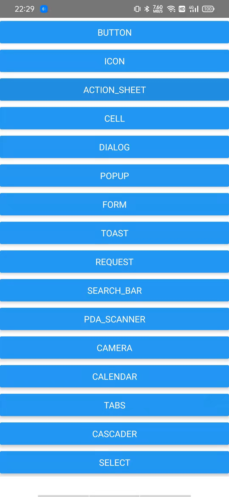

<p align="center">
<h1 align="center">gm-rn</h1>
<div align="center">观麦React Native 组件库，采用lerna分包管理</div>
</p>

<div align="center">


 [![NPM version][npm-image]][npm-url] ![NPM downloads][download-image]

[npm-image]: https://img.shields.io/npm/v/@gm-rn/components.svg?style=flat-square
[npm-url]: http://npmjs.org/package/@gm-rn/components


[download-image]: https://img.shields.io/npm/dm/@gm-rn/components.svg?style=flat-square
[download-url]: https://npmjs.org/package/@gm-rn/components


</div>

## ⌨️ 本地开发

```sh
git clone git@github.com:gmfe/gm-rn.git
cd gm-rn
# 安装依赖
yarn

# 各个包的依赖安装
lerna bootstrap

# 项目启动
yarn android
```


## ✨ 一些主要的packages

### @gm-rn/components

组件库

### @gm-rn/pda-scanner

pda 扫码相关

🔨 示例

```jsx
import React from 'react'
import { Button, Input } from '@gm-rn/components'
import { Tabs, FlexView, S } from '@gm-rn/components'

export default function TabsDemo() {
  return (
    <FlexView border bgWhite>
      <Tabs
        style={[S.bgWhite]}
        tabs={[
          { key: '1', tab: 'tab 1' },
          { key: '2', tab: 'tab 2' },
          { key: '3', tab: 'tab 3' },
          { key: '4', tab: 'tab 4' },
          { key: '5', tab: 'tab 5' },
          { key: '6', tab: 'tab 6' },
          { key: '7', tab: 'tab 7' },
        ]}
      />
    </FlexView>
  )
}
```



```jsx
import React, { useState } from 'react'
import { Text } from 'react-native'
import { Cascader, FlexView, S, Button, Toast } from '@gm-rn/components'
export default function CascaderDemo() {
  const [selected, setSelected] = useState('')
  const [close, setClose] = useState(false)
  return (
    <FlexView bgWhite flex>
      <Button
        type="primaryBg"
        style={{ width: 100, alignSelf: 'center' }}
        onPress={() => setClose((preStatus) => !preStatus)}>
        {close ? '关闭' : '显示'} x
      </Button>
      <Cascader
        onChange={(value) => setSelected(value.join('/'))}
        onClose={close ? () => Toast.info('点击了关闭') : undefined}
        options={[
          {
            label: '广东省',
            value: '广东省',
            children: [
              {
                label: '广州市',
                value: '广州市',
                children: [
                  {
                    label: '天河区',
                    value: '天河区',
                  },
                  {
                    label: '黄浦区',
                    value: '黄浦区',
                  },
                  {
                    label: '番禺区',
                    value: '番禺区',
                  },
                ],
              },
            ]
          }
          // ...
        ]}
      />
      <Text style={[S.textCenter]}>{selected}</Text>
    </FlexView>
  )
}

```


```jsx
import React, { useState } from 'react'
import { Text } from 'react-native'
import { Select, FlexView, S } from '@gm-rn/components'
export default function SelectsDemo() {
  const [value, setValue] = useState('1')
  return (
    <FlexView bgWhite>
      <Text style={[S.textCenter]}>基本使用</Text>
      <Select
        value={value}
        onChange={(selectedValue) => setValue(selectedValue)}
        data={[
          { value: '1', label: 'label 1' },
          { value: '2', label: 'label 2' },
          { value: '3', label: 'label 3' },
          { value: '4', label: 'label 4' },
          { value: '5', label: 'label 5' },
          { value: '6', label: 'label 6' },
          { value: '7', label: 'label 7' },
        ]}
      />
      <Text style={[S.textCenter]}>选项居中(prop: itemCenter = true)</Text>
      <Select
        itemCenter
        value={value}
        onChange={(selectedValue) => setValue(selectedValue)}
        data={[
          { value: '1', label: 'label 1' },
          { value: '2', label: 'label 2' },
          { value: '3', label: 'label 3' },
          { value: '4', label: 'label 4' },
          { value: '5', label: 'label 5' },
          { value: '6', label: 'label 6' },
          { value: '7', label: 'label 7' },
        ]}
      />
    </FlexView>
  )
}
```


其他的请看 [demo](./demo)下的


